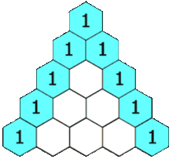

# Assignment 1: Recursion

## Exercise 1: Pascal’s Triangle

In mathematics, Pascal's triangle is a triangular array of the binomial coefficients.
In the Western world, it is named after French mathematician Blaise Pascal
The following pattern of numbers is called Pascal’s triangle.





The numbers at the edge of the triangle are all `1`, and each number inside the triangle is the sum of the two numbers above it.
Write a function that computes the elements of Pascal’s triangle by means of a recursive process.


```scala
def pascal(c: Int, r: Int): Int = {
  if (c == 0 || c == r) 1
  else pascal(c - 1, r - 1) + pascal(c, r - 1)
}
```

## Exercise 2: Parentheses Balancing

The problem was to take a string and determine if the parenthesis in the string matched using a recursive method.
Write a recursive function which verifies the balancing of parentheses in a string, which we represent as a `List[Char]` not a `String`.

Do this exercise by implementing the balance function in Main.scala.
Its signature is as follows:

```scala
def balance(chars: List[Char]): Boolean
```
#### Solution:
```scala
  def balance(chars: List[Char]): Boolean = {
    def loop(chars: List[Char], done: Int): Boolean =
      chars match {
        case Nil      => done == 0
        case '(' :: t => loop(t, done + 1)
        case ')' :: t => done > 0 && loop(t, done - 1)
        case _ :: t   => loop(t, done)
      }
    loop(chars, 0)
  }

```


## Exercise 3: Counting Change

The problem:
Given some numerical amount and some set of coin denominations we need to count the number of ways that we can represent the amount given the set of denominations.
Do that by writing a recursive function!
For example, there are 3 ways to give change for 4 if you have coins with denomiation 1 and 2: 1+1+1+1, 1+1+2, 2+2.

Do this exercise by implementing the countChange function in Main.scala. This function takes an amount to change, and a list of unique denominations for the coins.
Its signature is as follows:

```scala
def countChange(money: Int, coins: List[Int]): Int
```
#### Solution:
```scala
  def countChange(money: Int, coins: List[Int]): Int = {
    def loop(money: Int, coins: List[Int]): Int = {
      if (coins.isEmpty) 0
      else if (money - coins.head == 0) 1
      else if (money - coins.head < 0) 0
      else
        loop(money - coins.head, coins) + loop(money, coins.tail)
    }
    loop(money, coins.sorted)
  }
```


